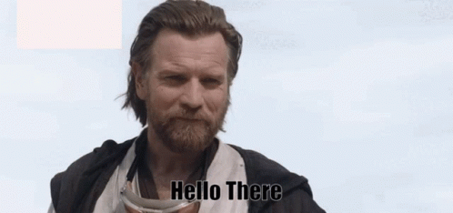
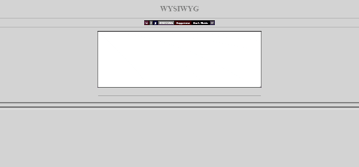
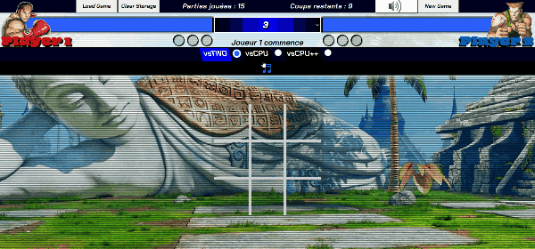
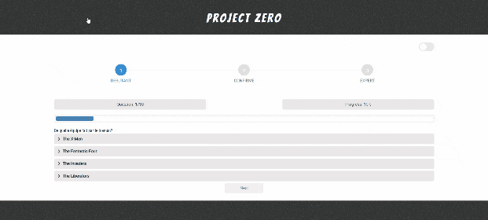

<!-- ABOUT START ############################################################################### -->
<h2 align="center">🌌 A propos de moi</h2>	
 

  
  

 

  

 

  Passionné depuis toujours par le numérique et ayant obtenu un diplôme de niveau bac+2 en développement web, j'approfondis actuellement mes connaissances en JavaScript et Unity.  
  Dans le même temps, je recherche une entreprise pour réaliser une alternance dans le but de valider un bachelor en développement web  :ok_hand:

<!-- ABOUT END ############################################################################### -->
<!-- SKILL START ############################################################################### -->
<h2 align="center">:cyclone: Langages / Framework / Outils :cyclone:</h2>
   

  <a href="https://skillicons.dev/">
       
        
      
  </a>

 
<!-- SKILL END ############################################################################### -->
 

<h2 align="center">:milky_way:	Projets</h2>
 
<!-- TABLE START ######################################################################################## -->
<table>
  <tr>
    <td align="center" width="350">
        
    </td>
    <td align="center" width="350">
        
    </td>
    <td align="center" width="350">
          
    </td>
  </tr>
    <tr>
    <td align="center" width="350">
        
         
    </td>
    <td align="center" width="350">
         
    </td>
    <td align="center" width="350">
          
    </td>
  </tr>
</table>

 
<!-- TABLE END ################################################################################# -->

<h1>
</h1>  

<!-- STATS START ############################################################################### -->
<table align="center">
  <tr>
    <td></td>
    <td></td>
  </tr>
</table>
 
<table>
  <tr>
    <td>
       
    </td>
  </tr>
</table>

<!-- STATS END ############################################################################### -->

<h1></h1>

